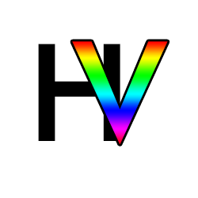

# HorizonVault - A FFXI Knowledge Repository

    

## About
HorizonVault is a repository of basic knowledge designed for both new and experienced players of the popular private server for Final Fantasy 11, HorizonXI. The purpose of the website is to collate and display static data about the game in an easily accessible, readable format, as well as providing a place to view video examples of ingame practices that new players may find difficult or confusing.

## UX Design

The design of the website was created so that users:

- Could navigate to labelled pages with the specific type of information they need
- Could navigate the website in a way that was clear and consistent across all pages
- Could find the information they were looking for in a readable and accessible format

## Target Audience

- New players for HorizonXI, looking to find out more about the game.
- More experienced players of HorizonXI, looking for a source of information to share with newer players.

## User Stories

**First time visitors:**

- As a first time visitor, I want to be able to navigate the site using a navbar that's easy to use.
- As a first time visitor, I want to be able to clearly understand the purpose of the site.
- As a first time visitor, I want guidance on which information might be immediately useful to me.
- As a first time visitor, I want content to be displayed in a readable format that isn't too intimidating to read.
- As a first time visitor, I want to be see consistent design between pages so I can recognize the key features easily.

**Frequent visitors:**

- As a frequent visitor, I want to be able to find information on quests that are useful to new players.
- As a frequent visitor, I want to see information that will be useful to new players just starting out.
- As a frequent visitor, I would like to see videos that show information in a way that is consistent and easy to understand.

## Features

TBC

## Bugs

- 

## Tools
- [HTML](https://developer.mozilla.org/en-US/docs/Web/HTML) - Page structure and content.
- [CSS](https://developer.mozilla.org/en-US/docs/Web/CSS) - Page appearance and styling rules.
- [CSS Flexbox](https://developer.mozilla.org/en-US/docs/Learn/CSS/CSS_layout/Flexbox) - Used to add responsiveness to pages.
- [Visual Studio Code](https://code.visualstudio.com/) - IDE used for project development.
- [Git](https://git-scm.com/) - Version control.
- [Github](https://github.com/) - Project Hosting.
- [Github Pages](https://pages.github.com/) - Project Deployment.

## Deployment
### Deployment to GitHub Pages

- The page was deployed in the early stages to GitHub pages. The steps to deploy are as follows:
    1. In the GitHub [Repository](https://github.com/Morgana-S/horizonvault), click the settings option at the top of the page.
    2. Under 'Code and Automation' on the left side, click 'Pages'.
    3. Under 'Build and Deployment' > 'Source', choose 'Deploy from a Branch'. The chosen branch to deploy should be 'Main'. Save these settings.
    4. Back under the code section at te top of the page, view the deployments on the right hand side, and select the 'Github-Pages' Deployment.

### Local Deployment
- In order to make a local copy of this project, it can be cloned. In your IDE terminal, type the following command to clone this repository:
- git clone https://github.com/Morgana-S/horizonvault.git

## Credits
- [Real Favicon Generator](https://realfavicongenerator.net/) - Import and assistance with generating favicon
- [Google Fonts](https://fonts.google.com/) - Importing of Fonts used within the project
- [Font Awesome](https://fontawesome.com/) - Icons and Script for use of Icons within project